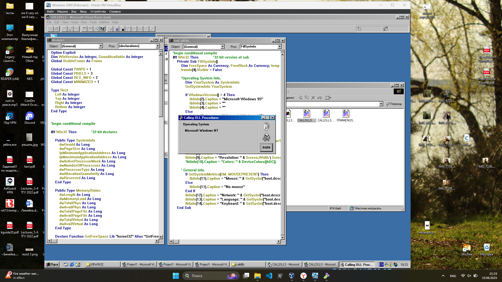

# CALLDLLS32
This application sources completely took from Microsoft samples and linked to PCode `PE`
binary.



### Main goal
Find diffenences between Visual Basic 4 header and old header (VB 4.0 too).

Disassembled structure looks like this:

All datatypes translates to undependent C# primitives
for saving size of every ~brain cell~ field.
```csharp
// took from Semi VBDecompiler by VBGamer45
public struct Vb4Header {
    public Char[] Signature;
    public UInt16 CompilerVersion;
    public UInt16 Undefined1;
    public UInt16 Undefined2;
    public UInt16 Undefined3;
    public UInt16 Undefined4;
    public UInt16 Undefined5;
    public UInt16 Undefined6;
    public UInt16 Undefined7;
    public UInt16 Undefined8;
    public UInt16 Undefined9;
    public UInt16 Undefined10;
    public UInt16 Undefined11;
    public UInt16 Undefined12;
    public UInt16 Undefined13;
    public UInt16 Undefined14;
    public UInt16 Undefined15;
    public UInt16 LanguageDllId;
    public UInt16 Undefined16;
    public UInt16 Undefined17;
    public UInt16 Undefined18;
    public UInt32 SubMainAddress;
    public UInt32 Address;
    public UInt16 Undefined21;
    public UInt16 Undefined22;
    public UInt16 Undefined23;
    public UInt16 Undefined24;
    public UInt16 Undefined25;
    public UInt16 Undefined26;
    public UInt16 ExeNameLength;
    public UInt16 ProjectNameLength;
    public UInt16 FormsCount;
    public UInt16 ModulesClassesCount;
    public UInt16 ExternComponentsCount;
    public UInt16 InEachFile176d;
    public UInt32 GuiTableOffset;
    public UInt32 UndefinedTableOffset;
    public UInt32 ExternComponentTableOffset;
    public UInt32 ProjectInfoTableOffset;
}
```

```csharp
// took from Semi VBDecompiler by VBGamer45
public struct OldVb4Header{
    public Byte PushCode;
    public UInt32 PushAddress;
    public Byte CallProcedureCode;
    public UInt32 ThunRtMainProcedure;
    public Byte B3;
    public Byte B4;
    public Int16 LanguageDllId;
    public Byte B5;
    public Byte B6;
    public Byte B7;
    public Byte B8;
    public Byte B9;
    public Byte B10;
    public Byte B11;
    public Byte B12;
    public Byte FormCount;
    public Byte B13;
    public UInt32 LAddress2;
    public UInt32 LAddress3;
    public UInt32 ThunRtProject;
    public UInt32 LAddress5;  // Long
    [MarshalAs(UnmanagedType.ByValArray, SizeConst = 19)]
    public Byte[] Ba;
    public UInt32 LAddress6;
} 
```

