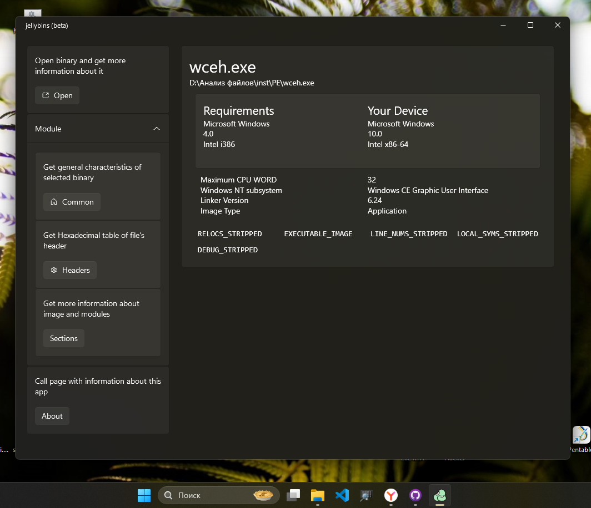
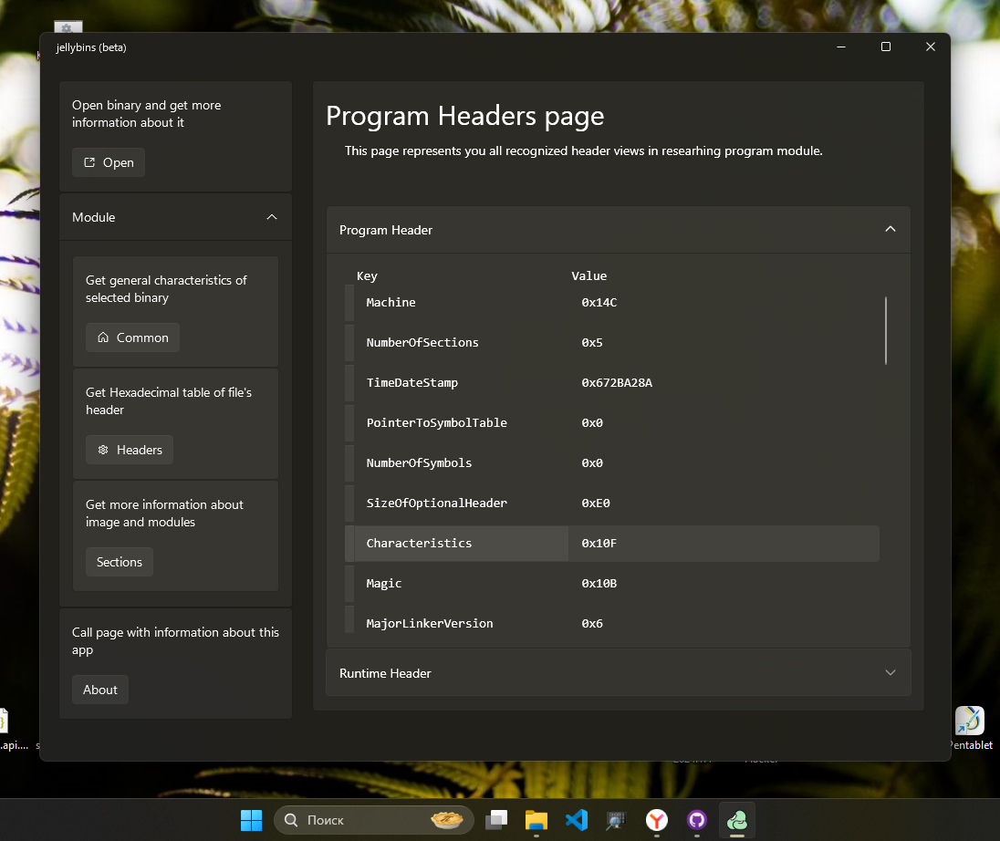
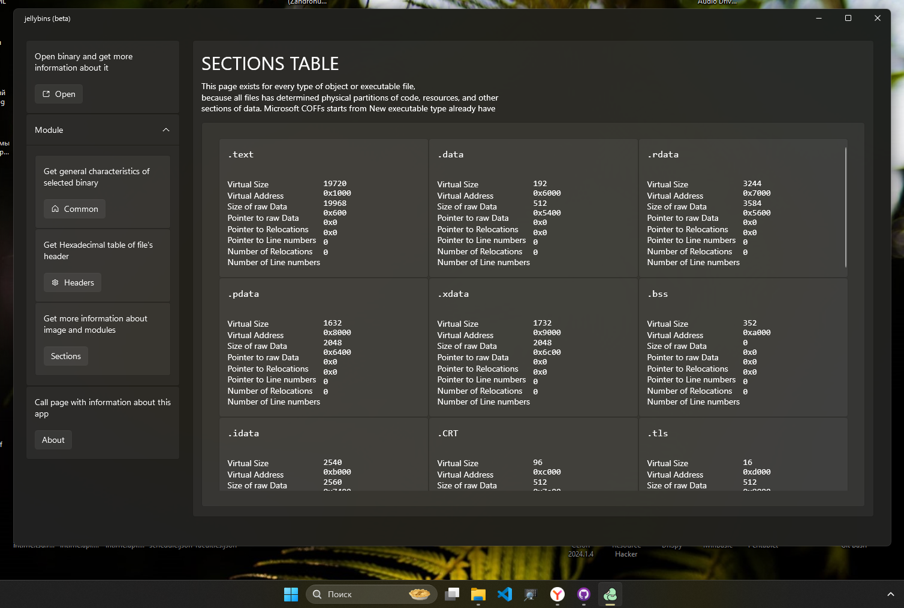

# JellyBins

JellyBins - Инструмент для анализа двоичных файлов. Это не `dnSpy` и не `OleDbg`, 
которые позволяют отлаживать или декомпилировать приложения. Это приложение
для просмотра основных свойств и требований двоичного файла к запуску. (по крайней мере, я создавал его именно из таких целей изначально).

JellyBins я активно использую для быстрой проверки приложений, драйверов, библиотек, и других объектов
и со временем дорабатываю функционал и точность определения, чтобы незапуская приложение
узнать возможные исключения и требования к запуску. 

Распознает:
 - `COM` (Command) первый формат исполняемых файлов в CP/M, B-DOS
    и других дисковых операционных системах
 - `MZ` (Mark Zbykowski)'сегментированные исполняемые файлы (MS-DOS 2.0)
 - `PE` (Portable Executable)'сегментированные исполняемые файлы (MS Windows NT)
 - `NE` (New Executable)'сегментированные файлы (OS/2 1.x MS-Windows 2x)
 - `LE` (Linear Executable)'сегментированные файлы (OS/2 2.x MS-Windows 3x|9x) 
 - Драйвера собранные по модели VxD (Virtual Device Driver)
 - `a-out` (Assembler Output) сегментированные исполняемые файлы 
    (использовались в ранних версиях ядра Linux 1.xx были широко распространены в Unix подобных ОС)

### Детали реализации Core-подмодулей

Разбор и создание отчета о исполняемых файлах делится на несколько подразделов.
На данный момент определяются они в таблице, где
 - Common - `CommonProperties` - информация о
    - Операционной системе
    - Архитектуре процессора
    - Предполагаемой версии ОС
    - Предполагаемой версии сборщика ПО
    - Предполагаемом подразделе run-time (если объект использует его)
    - Типе объекта
    - Используемой подсистеме для Microsoft Windows NT
 - Sections - `SectionProperties` - информация о таблице секций 
   или (если секции физически не определены) логических подразделов объекта
 - API - информация о экспортируемых и импортируемых функциях и модулях
 - Program Head - Программный заголовок - таблица которая присутствует
   практически у любого объектного файла и содержит общую информацию
   о требованиях к загрузке.

|    OS     |  Format   |  Common  | Sections | API  | Program Head |
|-----------|-----------|----------|----------|------|--------------|
| xx-DOS    | `MZ`      | OK       | OK       | OK   | OK           |
| CP/M, DOS | `COM`     | OK       | OK       |      | CANCELLED    |
| WindowsNT | `PE`      | OK       | OK       | WAIT | OK           |
| Windows2x | `NE`      | OK       | WAIT     |      | OK           |
| OS/2, ECS | `LE/LX`   | OK       | WAIT     |      | OK           |
| Unix      | `A-OUT`   | OK       | WAIT     |      | OK           |
| Unix      | `ELF`     |          |          |      |              |
| macOS     | `FAT`     |          |          |      |              |
| macOS     | Universal |          |          |      |              |

### Детали реализации Java подмодулей
Со временем использования, внезапно стало очень востребовано перепроверять модификации для Minecraft, поэтому с бета релизов
было решено добавить модуль `jellybins.Java.dll` для краткого отчета о используемых модификациях. В таблице указаны
 - Loader - метаданные о загрузчике
 - Manifest - YAML файл внутри архива `MANIFEST.MF`, который содержит
   информацию о сборке апплета.
 - Mod Metadata - метаданные самого мода для Java Minecraft

|  Loader     |  Loader  | Manifest | Mod meta |
|-------------|----------|----------|----------|
| Curse Forge | WAIT     | OK       | OK       |
| Fabric      | OK       | OK       | WAIT     |
| NeoForge    | WAIT     | WAIT     | WAIT     |
| Quilt       | OK       | OK       | WAIT     |

### Документы/источники?
Все, что я читал и изучал ранее, постепенно собирается в `jellybins.Documents`. 
Я должен был в идеальном случае сразу же определить и документацию и источники, 
но сделал это только спустя полгода ковыряния во внутренностях программного обеспечения.

В источниках собраны и исходные коды и ревью и мной написанные заметки/замечания и вопросы
по поводу того каким образом что работает, и я постепенно привожу этот раздел в порядок, структурируя
и добавляя потерянные (за полгода) и pdf документы и исходный код открытого программного обеспечения. 
(обязательно смотрю лицензию продукта или части продукта под которой он публикуется).

### Представление моделей

| View                   | ViewModel                           |                  Screenshot (Window)       |
|------------------------|-------------------------------------|--------------------------------------------|
| `CommonPropertiesPage` | `CommonPropertiesModel`             |     |
| `ProgramHeaderPage`    | `ProgramHeaderPageViewModel`        |   |
| `SectionPropertiesPage`| `SectionProprertiesViewModelModel`  |   |
| `ProgramInterfacePage` | `ProgramInterfaceModel`             | (В процессе)                               |
