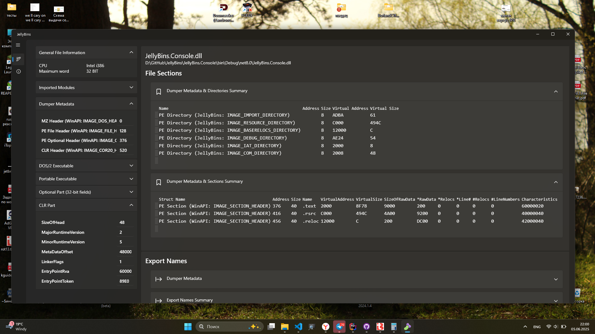
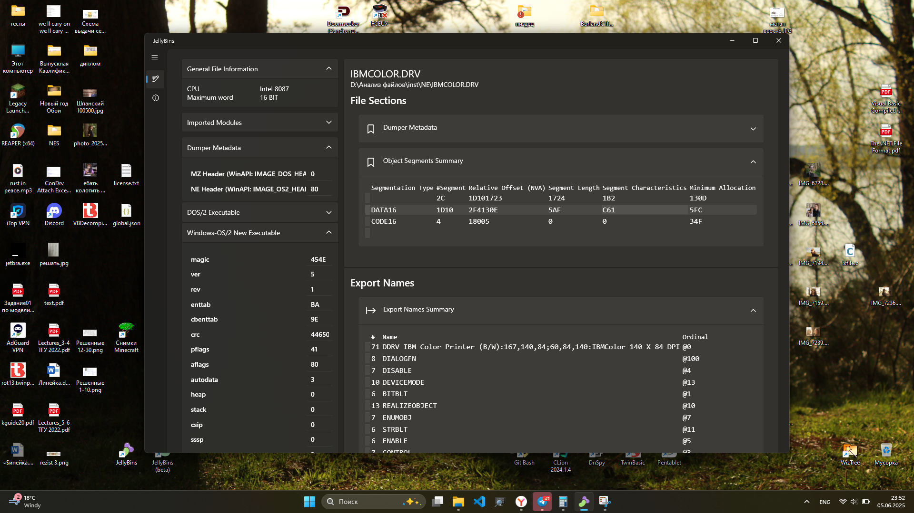
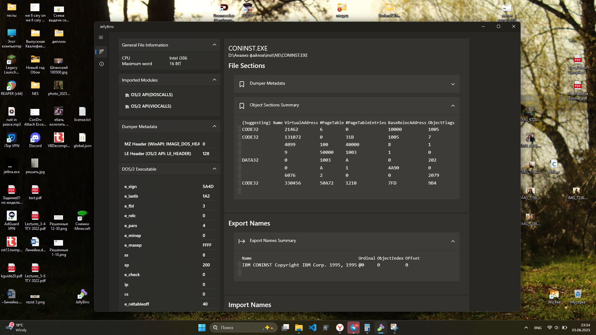
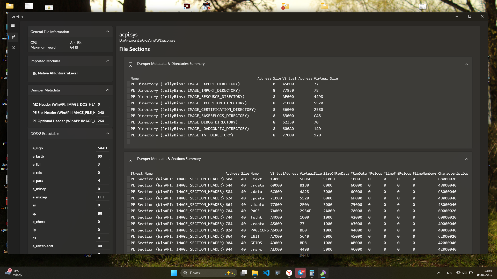

# JellyBiins.Client (jbw)

Is a Windowed application, made for Microsoft Windows Operating systems
strongly higher than 6.3 kernel version. (Windows 10/11 and higher...).

That's because Application built with Window frameworks which uses white/dark system theme, Acrillyc, Mica material effects, which added in Windows 11.

### Frameworks
 - .NET 8.0
 - .NET-Windows 8.0 (WPF modules) `<-- Base of Windowed Application`
 - [WpfUI](https://github.com/lepoco/wpfui) `<-- MVVM support and Mica-Material Controls`
 - [MicaWPF]() `<-- Window with optionial Mica effect support`

### Other screenshots

This region contains some screenshots with different linked binaries
which JellyBins can recognize and draw a report about.

Here's Windows-OS/2 `NE` segmented high-ring driver

Here's`LX/LE` segmented
OS/2 3x installer component, which took as
an example of secured system object.

Here's an ACPI Windows 10 driver, took
for researching exporting names.

### Additions
Planned to add [JellyMangle](https://github.com/AlexeyTolstopyatov/JellyMangle) part of this project
to undecorate IAT entries to C++ 17 declaration.
